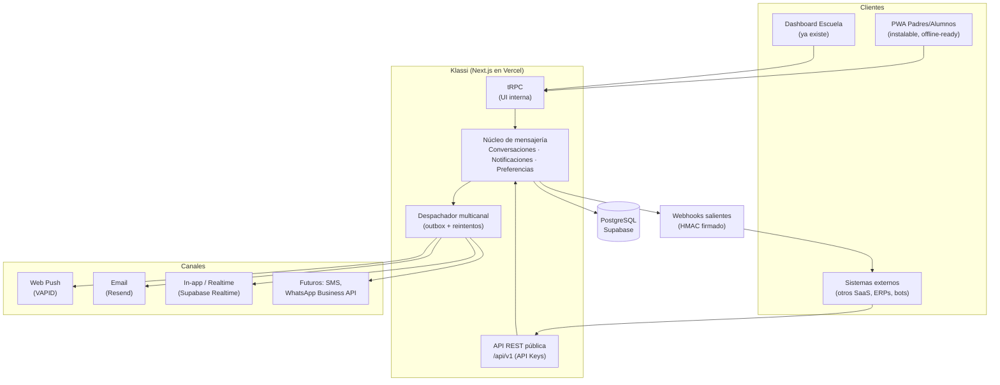

# Klassi Connect — Análisis de arquitectura: PWA de mensajería y notificaciones

> **Objetivo:** sustituir WhatsApp como canal de comunicación entre la escuela (staff) y los
> padres/alumnos, mediante una PWA instalable en el teléfono, integrada con el SaaS Klassi,
> con una API REST pública que permita a otros sistemas integrarse en el futuro.

**Estado:** propuesta de arquitectura (v1) · **Fecha:** 2026-07-02

---

## 1. Contexto: qué existe hoy en Klassi

| Pieza | Estado actual | Relevancia para este proyecto |
|---|---|---|
| Framework | Next.js 14 App Router, desplegado en Vercel (`vercel.json` con crons) | La PWA puede vivir en el mismo monolito |
| API interna | tRPC 10 (`src/server/api`) con `tenantProcedure` multi-tenant | Se reutiliza para la UI; la API pública será REST aparte |
| Base de datos | PostgreSQL en Supabase vía Prisma 5 | Supabase también aporta **Realtime** y **Storage** (adjuntos) |
| Auth | Clerk, con rol `PARENT` ya definido en `UserRole` | Los padres ya tienen un modelo de identidad (`User` + `ParentStudent`) |
| Email | Resend (`src/server/services/email.service.ts`) | Se convierte en un *canal* más del despachador de notificaciones |
| Comunicados | Modelo `Announcement` + router `announcements` — **solo marca `sentAt`, no entrega nada** | Es el primer caso de uso a conectar al nuevo sistema de entrega |
| Redis | Cliente `redis` en dependencias | Útil para rate-limiting y caché de la API pública |
| Multitenancy | `tenantId` en todas las tablas, slug por escuela | Toda la mensajería hereda este aislamiento |

**Conclusión clave:** no hay que construir desde cero — hay que añadir una *capa de entrega*
(canales push/email/in-app), una *capa de conversación* (chat), y una *capa de exposición*
(API REST pública), todas montadas sobre la infraestructura multi-tenant existente.

---

## 2. Visión general de la solución



Tres principios de diseño:

1. **Canal-agnóstico:** el dominio genera *eventos de notificación*; el despachador decide por
   qué canales entregarlos (push, email, in-app, y mañana SMS o incluso WhatsApp Business API).
   Sustituir WhatsApp no significa cerrar la puerta a otros canales.
2. **API-first:** todo lo que hace la UI de mensajería pasa por el mismo núcleo que expone la
   API REST pública. Los sistemas externos son ciudadanos de primera clase, no un añadido.
3. **Multi-tenant desde el día 1:** cada conversación, mensaje, suscripción push, API key y
   webhook pertenece a un `tenantId`. El aislamiento es idéntico al del resto de Klassi.

---

## 3. La PWA: decisiones y tecnologías

### 3.1 ¿PWA en el mismo proyecto o app separada?

**Recomendación: mismo monolito Next.js, route group propio** (p. ej. `src/app/(portal)/portal/...`).

- Reutiliza Clerk, tRPC, Prisma, diseño y despliegue en Vercel — cero infraestructura nueva.
- Un solo `manifest.json` con `start_url: /portal` hace que lo instalado en el teléfono sea
  directamente el portal de padres, no el dashboard.
- Si algún día se quiere separar (app nativa con Capacitor, subdominio `app.klassi.io`), la API
  REST pública ya existirá como frontera limpia.

### 3.2 Stack técnico de la PWA

| Necesidad | Tecnología recomendada | Por qué |
|---|---|---|
| Service Worker + precaché | **Serwist** (`@serwist/next`) | Sucesor mantenido de `next-pwa`, integración de primera clase con App Router de Next.js 14 |
| Manifest / instalabilidad | Manifest nativo de Next (`app/manifest.ts`) | Soporte built-in, tipado, sin dependencias |
| Push en el navegador | **Web Push API + VAPID** con la librería `web-push` en el servidor | Estándar W3C, **gratuito**, sin cuenta de Firebase; funciona en Chrome/Edge/Firefox/Safari |
| UI reactiva / estado | React Query (ya presente vía tRPC) | Ya está en el stack |
| Tiempo real (chat) | **Supabase Realtime** (Postgres Changes / Broadcast) | Ya pagan Supabase; evita un vendor extra (Pusher/Ably) |
| Offline | Serwist: `NetworkFirst` para datos, `CacheFirst` para estáticos + cola de mensajes salientes en IndexedDB (Background Sync donde exista) | La PWA debe abrir y mostrar lo último aunque no haya red |

### 3.3 Realidad de las notificaciones push por plataforma (importante)

| Plataforma | Soporte Web Push | Condición |
|---|---|---|
| Android (Chrome, Samsung, Firefox) | ✅ Completo | Funciona incluso sin instalar la PWA |
| iOS / iPadOS ≥ 16.4 (Safari) | ✅ | **Solo si el usuario instala la PWA en la pantalla de inicio** ("Compartir → Añadir a pantalla de inicio") |
| Escritorio (Chrome/Edge/Firefox/Safari) | ✅ | Normal |

Implicaciones de producto:

- El **onboarding de la PWA debe guiar activamente la instalación en iOS** (detectar
  `navigator.standalone` / `display-mode: standalone` y mostrar instrucciones si no está instalada).
  En Android usar el evento `beforeinstallprompt` para un botón "Instalar app".
- El **email queda como canal de respaldo garantizado**: si un padre no otorga permiso de push
  (o su navegador no lo soporta), el despachador degrada a email automáticamente.
- No se necesita FCM/Firebase para la web: `web-push` + VAPID habla directamente con los push
  services de Google/Apple/Mozilla. FCM solo sería necesario si más adelante se empaqueta una
  app nativa (Capacitor) — el diseño del despachador lo deja previsto (campo `channel`).

---

## 4. Modelo de dominio (nuevas tablas Prisma)

Dos subsistemas: **Conversaciones** (chat bidireccional escuela ↔ familia) y
**Notificaciones** (unidireccional: avisos, recordatorios de pago, asistencia, comunicados).

```prisma
// ─── Mensajería (chat) ───────────────────────────────────────────

enum ConversationType {
  DIRECT      // escuela ↔ familia (sobre un alumno)
  GROUP       // grupo/clase (ej. "Fútbol Infantil B")
  BROADCAST   // solo-lectura: comunicados de la escuela
}

model Conversation {
  id         String            @id @default(cuid())
  tenantId   String
  type       ConversationType  @default(DIRECT)
  title      String?           // para GROUP/BROADCAST
  studentId  String?           // ancla DIRECT a un alumno
  groupId    String?           // ancla GROUP a un Group existente
  createdAt  DateTime          @default(now())
  updatedAt  DateTime          @updatedAt
  lastMessageAt DateTime?

  participants ConversationParticipant[]
  messages     Message[]

  @@index([tenantId, lastMessageAt])
  @@index([tenantId, studentId])
}

model ConversationParticipant {
  id             String   @id @default(cuid())
  conversationId String
  userId         String
  role           String   @default("MEMBER") // MEMBER | ADMIN | READONLY
  lastReadAt     DateTime?
  muted          Boolean  @default(false)
  joinedAt       DateTime @default(now())

  @@unique([conversationId, userId])
  @@index([userId])
}

model Message {
  id             String    @id @default(cuid())
  conversationId String
  senderId       String?   // null = mensaje de sistema
  body           String
  attachments    Json      @default("[]") // [{url, name, mime, size}] en Supabase Storage
  externalRef    String?   // id idempotente para integraciones (API pública)
  createdAt      DateTime  @default(now())
  editedAt       DateTime?
  deletedAt      DateTime? // borrado suave

  @@index([conversationId, createdAt])
}

// ─── Notificaciones (outbox multicanal) ─────────────────────────

enum NotificationChannel { PUSH EMAIL IN_APP } // futuro: SMS, WHATSAPP
enum DeliveryStatus { PENDING SENT DELIVERED FAILED SKIPPED }

model Notification {
  id        String   @id @default(cuid())
  tenantId  String
  userId    String            // destinatario
  type      String            // "announcement" | "payment.reminder" | "message.new" | "attendance.absent" ...
  title     String
  body      String
  data      Json     @default("{}") // deep-link: {url, conversationId, paymentId...}
  readAt    DateTime?
  createdAt DateTime @default(now())

  deliveries NotificationDelivery[]

  @@index([userId, readAt])
  @@index([tenantId, createdAt])
}

model NotificationDelivery {
  id             String              @id @default(cuid())
  notificationId String
  channel        NotificationChannel
  status         DeliveryStatus      @default(PENDING)
  attempts       Int                 @default(0)
  lastError      String?
  sentAt         DateTime?

  @@index([status])          // el worker consume PENDING/FAILED
  @@index([notificationId])
}

model PushSubscription {
  id        String   @id @default(cuid())
  userId    String
  tenantId  String
  endpoint  String   @unique   // URL del push service del navegador
  p256dh    String
  auth      String
  userAgent String?
  createdAt DateTime @default(now())
  lastUsedAt DateTime?

  @@index([userId])
}

model NotificationPreference {
  id       String  @id @default(cuid())
  userId   String
  tenantId String
  type     String            // mismo vocabulario que Notification.type, o "*"
  channel  NotificationChannel
  enabled  Boolean @default(true)

  @@unique([userId, tenantId, type, channel])
}

// ─── Plataforma de integración (API pública) ────────────────────

model ApiKey {
  id         String    @id @default(cuid())
  tenantId   String
  name       String              // "Integración ERP contable"
  keyHash    String    @unique   // SHA-256; el secreto solo se muestra al crearla
  prefix     String              // "klassi_pk_Ab3d" visible para identificarla
  scopes     Json      @default("[]") // ["messages:write","notifications:send","students:read"]
  lastUsedAt DateTime?
  expiresAt  DateTime?
  revokedAt  DateTime?
  createdAt  DateTime  @default(now())

  @@index([tenantId])
}

model WebhookEndpoint {
  id        String   @id @default(cuid())
  tenantId  String
  url       String
  secret    String            // para firma HMAC-SHA256
  events    Json     @default("[]") // ["message.created","payment.paid", ...]
  isActive  Boolean  @default(true)
  createdAt DateTime @default(now())

  deliveries WebhookDelivery[]

  @@index([tenantId])
}

model WebhookDelivery {
  id         String   @id @default(cuid())
  endpointId String
  event      String
  payload    Json
  status     Int?              // HTTP status de respuesta
  attempts   Int      @default(0)
  nextRetryAt DateTime?
  createdAt  DateTime @default(now())

  @@index([endpointId, createdAt])
  @@index([nextRetryAt])
}
```

Notas de diseño:

- **`Announcement` no se elimina**: `announcements.send` pasa a crear una `Conversation`
  tipo `BROADCAST` (opcional) y sobre todo a generar `Notification` + `NotificationDelivery`
  por destinatario. Hoy ese endpoint solo marca `sentAt` — este es el primer hueco a cerrar.
- **Outbox pattern**: crear el mensaje/notificación y sus filas de entrega es una única
  transacción en Postgres; la entrega física ocurre después, con reintentos. Nada se pierde si
  falla el push service.
- **`externalRef` en `Message`** da idempotencia a las integraciones (un ERP que reintenta un
  POST no duplica el mensaje).

---

## 5. Base de datos: ¿compartida o separada?

**Decisión: la misma base de datos PostgreSQL (mismo proyecto Supabase), mismo schema Prisma.**

### Por qué compartida

1. **El dominio de mensajería está amarrado al grafo existente.** Cada envío resuelve la cadena
   `targetGroups → Enrollment → Student → ParentStudent → User → PushSubscription`. En la misma
   BD eso es un JOIN; con BD separada habría que replicar ese grafo (sincronización, datos
   desactualizados) o hacer llamadas entre servicios en cada fan-out.
2. **El patrón outbox exige transacciones locales.** Mensaje + notificación + filas de entrega se
   crean en una sola transacción; con dos BD serían transacciones distribuidas o consistencia
   eventual — complejidad injustificada.
3. **Supabase Realtime opera sobre esta BD.** Separarla implicaría un segundo proyecto Supabase
   con su propia autorización de canales.
4. **Costo operativo:** un pipeline de migraciones, un backup, un pooler, un modelo `tenantId`.

### El volumen real no es un problema para Postgres

Una escuela de 500 alumnos con 20 comunicados/mes genera ~10k notificaciones mensuales; incluso
con chat activo y cientos de escuelas se trata de decenas de miles de escrituras al día.
Postgres sostiene miles de inserts por segundo — hay 2–3 órdenes de magnitud de margen.

### Riesgos reales y mitigaciones (dentro de la misma BD)

| Riesgo | Mitigación |
|---|---|
| Picos de fan-out (comunicado a 800 padres ≈ 2,400 filas) | `createMany` por lotes y fan-out en el worker/cron, nunca en el request del usuario |
| Conexiones en serverless (Vercel) | Ya resuelto: `directUrl` + URL con pooler (Supavisor) en `schema.prisma` |
| Crecimiento de logs (`NotificationDelivery`, `WebhookDelivery`) | Job de retención: purgar entregas exitosas > 60–90 días |
| Lecturas calientes del chat | Índice `(conversationId, createdAt)` + paginación por cursor |
| Carga de replicación WAL por Realtime | Usar **Broadcast** explícito en vez de Postgres Changes |
| Reportes pesados compitiendo con chat | Paso intermedio antes de separar nada: **réplica de lectura** en Supabase para reportes |

### Cuándo sí separar

Señales concretas: cientos de millones de mensajes acumulados, contención de escritura
sostenida que los índices ya no resuelven, o que la mensajería se convierta en un producto
independiente de los datos de Klassi. La preparación para ese futuro ya está en el diseño:
código aislado en servicios (`NotificationService`, `MessageService`) y consumo externo solo
vía API REST — extraer después significa mover tablas, no reescribir la aplicación. Separar
hoy sería pagar el costo de un sistema distribuido para un problema que no existe.

---

## 6. Registro y acceso de los padres (onboarding)

**Principio: la escuela da de alta al tutor al inscribir al alumno; el padre nunca "se registra
solo"** — siempre entra por una invitación, lo que garantiza que cada cuenta queda vinculada a
los alumnos correctos desde el primer login.

### 6.1 Modelo: invitación de padre

Mismo patrón que el `TeamInvitation` existente para staff, pero apuntando a alumnos:

```prisma
model ParentInvitation {
  id         String   @id @default(cuid())
  tenantId   String
  email      String?            // al menos uno de email/phone
  phone      String?
  name       String?            // "Rosa Martínez"
  studentIds Json     @default("[]") // alumnos a vincular al aceptar
  token      String   @unique
  status     String   @default("PENDING") // PENDING | ACCEPTED | REVOKED | EXPIRED
  invitedBy  String?
  expiresAt  DateTime
  createdAt  DateTime @default(now())

  @@index([tenantId, status])
  @@index([email])
}
```

La vinculación se hace **siempre por token, nunca por coincidencia de email/teléfono** — así el
flujo es idéntico con o sin correo y un typo en recepción no vincula a la persona equivocada.

### 6.2 Flujo A — el tutor tiene correo

1. Al inscribir al alumno, recepción captura nombre, parentesco y correo del tutor →
   se crea `ParentInvitation` + email vía Resend con enlace `/portal/activar/[token]`.
2. El padre abre el enlace, ve a sus hijos ya vinculados y **crea su contraseña ahí mismo**
   (o entra con Google) — Clerk maneja ambos. El token prueba la propiedad del correo;
   no hace falta un paso extra de verificación.
3. El webhook `user.created` de Clerk (ya existe en `/api/webhooks/clerk`) resuelve la
   invitación: crea `User` (rol `PARENT`), un `ParentStudent` por hijo y marca la invitación
   como `ACCEPTED`.
4. Si el correo ya tiene cuenta (otro hijo u otra escuela Klassi), no se crea cuenta nueva:
   solo se agregan vínculos. Un padre con hijos en dos escuelas ve ambas con un solo login.

### 6.3 Flujo B — solo tiene teléfono

Clerk soporta **autenticación por teléfono con código SMS (OTP)**: el padre entra con su
número y un código de 6 dígitos, sin contraseña que recordar — para usuarios poco técnicos es
incluso mejor. El reto no es la autenticación sino entregar la invitación sin correo:

| Entrega | Costo | Cuándo |
|---|---|---|
| **QR en recepción** (pantalla del dashboard o impreso en el comprobante) | $0 | ✅ Recomendado: el padre lo escanea en el mostrador y la recepcionista le ayuda a instalar la PWA y aceptar el permiso de push en ese momento |
| SMS con enlace corto (Twilio / SMS de Clerk) | por mensaje | Inscripciones a distancia |

Implicaciones:

- Sin correo no hay canal de respaldo email: **el push se vuelve el canal principal** para ese
  usuario, por eso el onboarding en mostrador debe confirmar el permiso de notificaciones.
  El despachador marca el canal EMAIL como `SKIPPED` cuando `User.email` es null.
- `User.email` pasa a ser opcional para cuentas de padres (hoy es requerido en el schema);
  el identificador estable es el `clerkId`.

### 6.4 Casos límite

- **Ni correo ni smartphone**: el alumno queda sin portal; el dashboard lo señala como
  "sin acceso al portal" para que la escuela sepa que a esa familia se le avisa en persona.
- **Dos o más tutores por alumno**: cada uno recibe su propia invitación
  (`ParentStudent` ya soporta N tutores con `isPrimary`).
- **Cambio de correo/teléfono**: se edita en Clerk (perfil) y el webhook `user.updated`
  sincroniza el `User` local; las invitaciones pendientes se pueden revocar y reenviar.
- **Expiración**: invitaciones con `expiresAt` (p. ej. 30 días) y reenvío con un clic desde
  la ficha del alumno.

---

## 7. Despachador multicanal (el corazón del sistema)

```
Evento de dominio ──► NotificationService.notify()
   (comunicado,           │ 1. resuelve destinatarios (targetGroups → enrollments → parents)
    pago vencido,         │ 2. aplica NotificationPreference de cada usuario
    mensaje nuevo,        │ 3. crea Notification + NotificationDelivery (transacción única)
    falta de asistencia)  ▼
                    Cola de entrega
                          │  worker consume PENDING
                          ├─► PUSH  → web-push (VAPID) → si 404/410: borrar PushSubscription
                          ├─► EMAIL → Resend (servicio existente)
                          └─► IN_APP→ insert ya visible + Supabase Realtime lo empuja al cliente
```

### 7.1 ¿Qué usar como cola en Vercel (serverless)?

BullMQ no encaja bien en serverless (necesita workers de larga vida). Opciones reales:

| Opción | Pros | Contras | Veredicto |
|---|---|---|---|
| **Upstash QStash** | HTTP-nativo, reintentos/backoff incluidos, DLQ, encaja perfecto con Vercel; ya usan Upstash-style Redis | Vendor adicional (barato) | ✅ **Recomendado** |
| Vercel Cron + tabla outbox | Cero vendors nuevos: un cron cada minuto procesa `NotificationDelivery PENDING` (patrón ya usado en `api/cron/*`) | Latencia de hasta 1 min; lotes limitados por timeout de función | ✅ **Plan B perfectamente válido para el MVP** |
| Inngest / Trigger.dev | DX excelente, pasos duraderos | Otro vendor, más superficie | Solo si crecen los flujos |
| Supabase Queues (pgmq) + pg_cron | Todo dentro de Supabase | Workers = Edge Functions (otro runtime a mantener) | Alternativa razonable |

**Recomendación:** empezar con **cron + outbox** (patrón que el equipo ya domina) y migrar el
disparo a **QStash** cuando la latencia de 1 minuto sea insuficiente (p. ej. para chat, donde
la notificación push debe salir en segundos, se puede invocar el worker inline tras el POST y
dejar el cron como red de seguridad).

### 7.2 Tiempo real del chat

**Supabase Realtime (Broadcast)**: al insertar un `Message`, el servidor publica en el canal
`tenant:{tenantId}:conversation:{id}`. La PWA suscrita lo pinta al instante; si la app está
cerrada, la `NotificationDelivery` PUSH despierta al usuario. Autorización mediante RLS o
tokens de canal firmados — nunca exponer el `service_role` al cliente.

Alternativas (Pusher, Ably) solo si Supabase Realtime diera problemas de escala; a miles de
conexiones concurrentes por escuela no se llegará pronto.

---

## 8. API REST pública (`/api/v1`) — Klassi como plataforma

### 8.1 Principios

- **Versionada por URL** (`/api/v1/...`), JSON, errores con formato consistente
  (`{ "error": { "code", "message" } }`).
- **Autenticación por API Key** (`Authorization: Bearer klassi_sk_...`), una o varias por tenant,
  con **scopes** granulares y revocables. La key se guarda hasheada (SHA-256); solo se muestra
  completa al crearla. El tenant se deriva de la key — imposible cruzar tenants.
- **Rate limiting** por key con Redis existente (`@upstash/ratelimit` o equivalente) +
  cabeceras `X-RateLimit-*`.
- **Idempotencia**: cabecera `Idempotency-Key` en los POST de envío (mapea a `externalRef`).
- **OpenAPI 3.1** publicado en `/api/v1/openapi.json` + docs navegables. Opciones:
  - `zod-openapi` / `@asteasolutions/zod-to-openapi` reutilizando los schemas Zod existentes ✅
  - `trpc-openapi` para exponer routers tRPC como REST (atajo válido, menos control del contrato)

### 8.2 Superficie mínima v1

```
# Notificaciones (el caso de uso estrella para integradores)
POST   /api/v1/notifications            # enviar a userId(s), studentId(s) o groupId(s)
GET    /api/v1/notifications/{id}       # estado de entrega por canal

# Mensajería
GET    /api/v1/conversations
POST   /api/v1/conversations            # crear/obtener conversación (p.ej. DIRECT por studentId)
GET    /api/v1/conversations/{id}/messages
POST   /api/v1/conversations/{id}/messages

# Directorio (solo-lectura para integraciones)
GET    /api/v1/students · /api/v1/groups · /api/v1/payments

# Plataforma
GET/POST/DELETE /api/v1/webhooks        # gestión de endpoints salientes
```

### 8.3 Webhooks salientes (la otra mitad de "que otro sistema se integre")

- Eventos: `message.created`, `notification.delivered`, `payment.paid`, `attendance.recorded`,
  `student.enrolled`, …
- Firma **HMAC-SHA256** en cabecera (`Klassi-Signature: t=...,v1=...`, estilo Stripe — el equipo
  ya consume webhooks de Stripe y Clerk, el patrón es familiar).
- Reintentos con backoff exponencial (mismo worker/cron del despachador) y registro en
  `WebhookDelivery` para debugging del integrador.

Con **API Keys + REST versionado + webhooks firmados**, cualquier sistema externo puede tanto
*empujar* mensajes hacia las familias como *reaccionar* a lo que ocurre en Klassi. Ese es el
contrato de plataforma SaaS que se pide.

---

## 9. Seguridad y multi-tenant

- **Padres/alumnos**: Clerk (rol `PARENT` ya existe). Un padre solo ve conversaciones donde es
  `ConversationParticipant`, y estas siempre están ancladas a sus hijos vía `ParentStudent`.
  El acceso actual por token (`/alumno/[token]`) puede convivir, pero el chat exige sesión real.
- **Staff**: mismos roles actuales (`ADMIN`, `RECEPTIONIST`, `INSTRUCTOR`); un instructor solo
  accede a conversaciones de sus grupos.
- **API pública**: scopes por key, rate limit, key hasheada, rotación y revocación desde el
  dashboard (`/dashboard/configuracion/integraciones`).
- **Push**: las claves VAPID (par público/privado) van en variables de entorno; las
  suscripciones caducadas (HTTP 404/410 del push service) se purgan automáticamente.
- **Contenido**: adjuntos en Supabase Storage con URLs firmadas de corta vida, bucket por tenant.
- **Privacidad**: borrado suave de mensajes, retención configurable por tenant (requisito
  frecuente al tratar datos de menores).

---

## 10. Plan de implementación por fases

| Fase | Alcance | Entregable verificable |
|---|---|---|
| **1. PWA base** (1ª iteración) | `manifest.ts` + Serwist + route group `(portal)` con login Clerk para padres, vista de comunicados e historial de pagos del alumno | La app se instala en Android/iOS y abre el portal |
| **2. Push + centro de notificaciones** | Tablas `Notification*` y `PushSubscription`, claves VAPID, opt-in de permiso, campana in-app, preferencias | Un comunicado dispara push real al teléfono con fallback a email |
| **3. Comunicados conectados** | `announcements.send` → despachador (fan-out a padres por `targetGroups`), recordatorios de pago del cron `generate-payments` → push | El flujo existente deja de ser "solo `sentAt`" |
| **4. Chat** | Tablas `Conversation*`/`Message`, UI de chat en PWA y dashboard, Supabase Realtime, adjuntos | Escuela y padre conversan en tiempo real; push si la app está cerrada |
| **5. Plataforma** | `/api/v1` + API Keys + scopes + rate limit + OpenAPI + webhooks salientes | Un sistema externo envía una notificación con `curl` y recibe webhooks firmados |

Las fases 1–3 sustituyen el 80 % del uso real de WhatsApp (avisos y recordatorios) sin
necesidad de chat; conviene lanzar eso primero y medir la adopción de instalación/permiso de
push antes de invertir en la fase 4.

---

## 11. Resumen de decisiones tecnológicas

| Área | Decisión | Alternativa descartada y por qué |
|---|---|---|
| Arquitectura app | Mismo monolito Next.js, route group `(portal)` | App separada: duplica auth/deploy sin beneficio actual |
| Base de datos | Compartida (mismo Postgres/Supabase, mismo schema) | BD separada: transacciones distribuidas y replicación del grafo de datos, sin problema real de escala que lo justifique |
| Alta de padres | Invitación por token creada al inscribir al alumno (email o QR + teléfono/OTP de Clerk) | Registro abierto: imposible saber a qué alumnos vincular y abre la puerta a cuentas ajenas al tenant |
| Service worker | Serwist | `next-pwa` (sin mantenimiento activo), SW manual (más error-prone) |
| Push | Web Push estándar + VAPID (`web-push`) | FCM: innecesario para web, añade Firebase; se reconsidera solo si hay app nativa |
| Tiempo real | Supabase Realtime | Pusher/Ably: vendor y coste extra sin necesidad de escala hoy |
| Cola de entrega | Cron + outbox en Postgres (MVP) → QStash al necesitar latencia baja | BullMQ: requiere workers persistentes, incompatible con Vercel serverless |
| Email | Resend (existente) como canal de fallback | — |
| API pública | REST `/api/v1` + Zod→OpenAPI + API Keys con scopes | GraphQL: peor DX para integradores pequeños; exponer tRPC: acopla el contrato interno |
| Webhooks | HMAC-SHA256 estilo Stripe con reintentos | Polling: traslada el coste al integrador |
